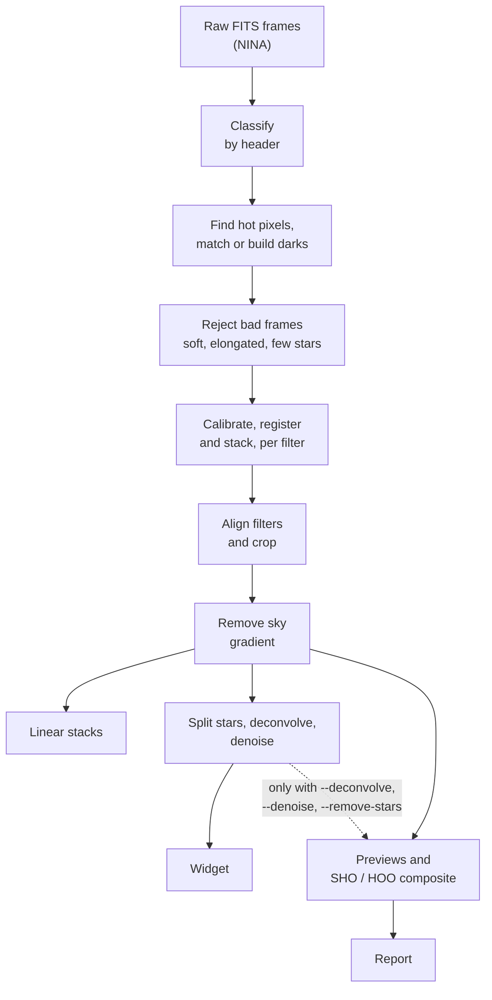
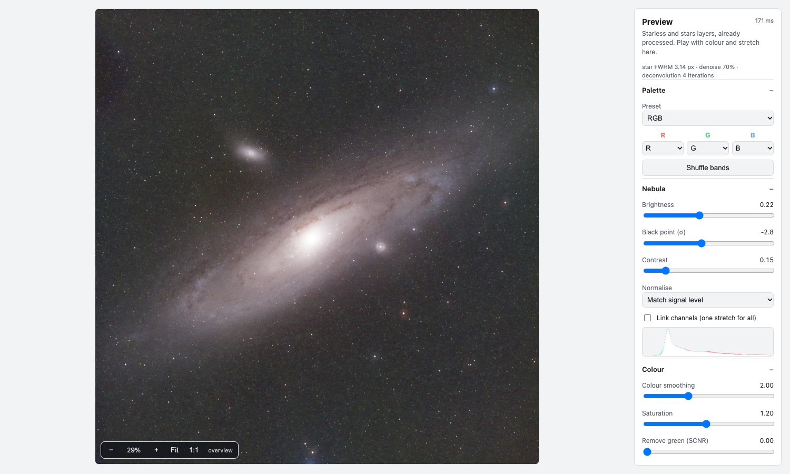
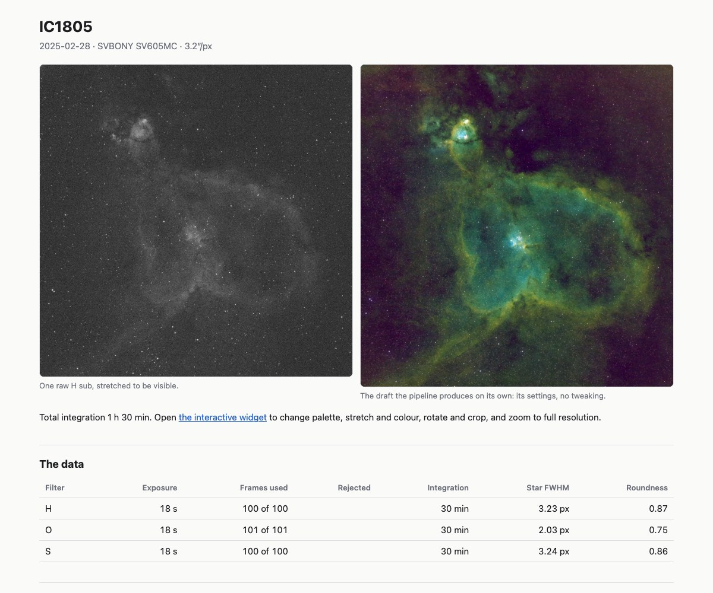

# firstlight

Process a night of astrophotography in one command: raw FITS frames in; aligned linear stacks, previews and a report out. A desktop app and an interactive widget help you tune colour and stretch afterwards.





*The preview widget, with Andromeda stacked from three filters of 18 s frames. Palette, stretch, colour and framing are live controls on layers that were already processed at full resolution.*

```
firstlight ~/astro/2026-10-03 -o ~/astro/2026-10-03-out
```

firstlight reads the FITS frames, sorts them by header (not by folder name), calibrates, registers and stacks each target and filter with [Siril](https://siril.org), aligns the filters to each other, and writes:

- **Linear stacks**, one 32-bit FITS per filter, aligned and cropped to a common area with the sky gradient removed. This is the real output, ready for finishing in Siril.
- **Previews**: auto-stretched JPGs per filter and an SHO (three filters), HOO (H + O) or RGB composite. These are throwaway; judge the night with them.
- **A report** (`report.html`, [example for the Heart Nebula](https://htmlpreview.github.io/?https://github.com/sergiomarrocoli/astro-pipeline/blob/main/docs/report-ic1805.html), [file](docs/report-ic1805.html)): a raw sub next to the result, frames used and rejected, integration per filter, star size, frame-quality charts and a sensor-tilt check.
- **A widget** (`preview/widget.html`): a self-contained page for playing with palette, stretch, colour and framing on the processed layers, with full-resolution tiles on zoom. It needs no server; open it next to its `widget_tiles/` folder.

[](https://htmlpreview.github.io/?https://github.com/sergiomarrocoli/astro-pipeline/blob/main/docs/report-ic1805.html)

Colour balance and the final stretch are left to you; the tool stops where taste starts.

## What it does for you

- Finds the sensor's **hot pixels from the lights** (no darks needed) and fixes them before stacking.
- Keeps a **dark library** (`~/.firstlight/library`), matched on camera, binning, gain, offset, exposure (within 0.5 s) and temperature (within 1.5 C). Without a match it says why and falls back to the hot-pixel list.
- **Rejects bad frames** (soft, elongated or star-poor ones) by comparing each with its neighbours in time, never more than 25% of a group.
- Removes the **sky gradient** per filter, conservatively: it will not model a bright region as sky.
- Optional **star/starless split**, deconvolution of the stars and denoising of the starless layer (`--deconvolve`, `--denoise`, `--remove-stars`).

Every stage keeps its Siril script (`.ssf`) and log beside its output, and a re-run skips stages whose inputs have not changed.

## Install

Requires Python 3.10 or newer and Siril 1.4 or newer (`brew install siril`; `siril-cli` on PATH, or `/Applications/Siril.app`).

```
python3.14 -m venv .venv
.venv/bin/pip install -e '.[dev]'
.venv/bin/firstlight --help
```

There is also a desktop app, `firstlight-app` (`pip install -e '.[app]'`), with folder pickers, a live log and links to each result.

## Usage

```
firstlight <night-folder> -o <out> [--target NGC] [--filter H] [--dry-run] [--keep-intermediates]
           [--all-exposures] [--deconvolve] [--denoise] [--remove-stars]
           [--no-darks] [--no-hot-pixel-fix] [--no-reject-frames]
```

`--dry-run` writes and prints every generated script without running Siril. Input is **NINA output**: one FITS per frame with NINA's headers (`IMAGETYP`, `OBJECT`, `FILTER`, `EXPTIME`, `GAIN`, `OFFSET`, sensor temperature). Only the exposure time with the most integration per filter is stacked unless you pass `--all-exposures`.

`utils/unpack_sharpcap.py` converts old SharpCap captures (Siril FITSEQ files) into NINA-style frames, for test data.

## Sample data

[`samples/`](samples) holds one linear stack per filter from a single night (2025-02-28, SharpCap, 18 s subs): the Heart Nebula (`ic1805/stack_{H,O,S}.fits`, 100 frames each) and Andromeda (`m31/stack_{R,G,B}.fits`, about 50 frames each, calibrated with a master dark). They are tile-compressed (RICE_1) 32-bit FITS files of about 7.5 MB, readable by astropy and Siril. They are stacks, so they stand in for the output of the stacking stage; the raw frames are not in the repo. The images in this README were made from them.

## Status

Built: classification, dark library, hot pixels, frame rejection, stacking, cross-filter alignment, background removal, previews, report, widget, desktop app. Not built yet: GraXpert, plate solving, flats. Developed against an SVBONY SV605 mono with H, O and S filters.

[`docs/PLAN.md`](docs/PLAN.md) is the original brief; `CLAUDE.md` describes the architecture and what was learned on real data.

## Tests

```
.venv/bin/pytest -q
```

No Siril is needed for the tests.
